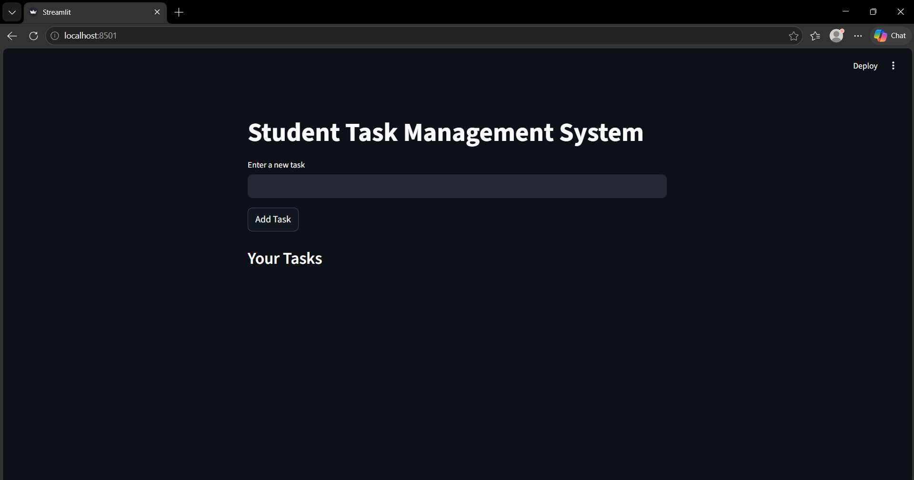

# 📚 Student Task Management System

## 📌 Project Overview

The **Student Task Management System** is a simple web-based application developed using Python and Streamlit. It helps students manage their daily tasks efficiently by allowing them to add, view, and mark tasks as completed.

---

## 🎯 Objectives

* To help students organize their daily activities
* To improve productivity and time management
* To apply project management concepts in a practical project

---

## 🛠️ Technologies Used

* **Python**
* **Streamlit**
* **Git & GitHub**

---

## ⚙️ Features

* ➕ Add new tasks
* 📋 View all tasks
* ✅ Mark tasks as completed

---

## 📊 Project Management Concepts Implemented

### 📘 Module 1: Introduction to Project Management

* Defined project objectives, stakeholders, and lifecycle

### 📘 Module 2: Risk Management & Planning

* Identified possible risks and mitigation strategies
* Planned project execution steps

### 📘 Module 3: Requirements Gathering

* Documented functional and non-functional requirements

### 📘 Module 4: Testing & Maintenance

* Created test cases
* Performed manual testing

### 📘 Module 5: Globalization & Internet Impact

* Explained global usability
* Role of internet in application deployment

---

## ▶️ How to Run the Project

1. Install dependencies:

```
pip install -r requirements.txt
```

2. Run the application:

```
python -m streamlit run app.py
```

3. Open in browser:

```
http://localhost:8501
```

---

## 📸 Screenshots

### Home Screen



### Add Task


### Completed Task


---

## 🧪 Testing

* Manual testing was performed
* Verified task addition and completion features
* Ensured correct output for all test cases

---

## 📌 Conclusion

This project demonstrates the application of project management concepts in developing a simple and functional software system. It also highlights the importance of planning, risk management, and testing in successful project execution.

---

## 👨‍💻 Author

**Hemanth K S**
