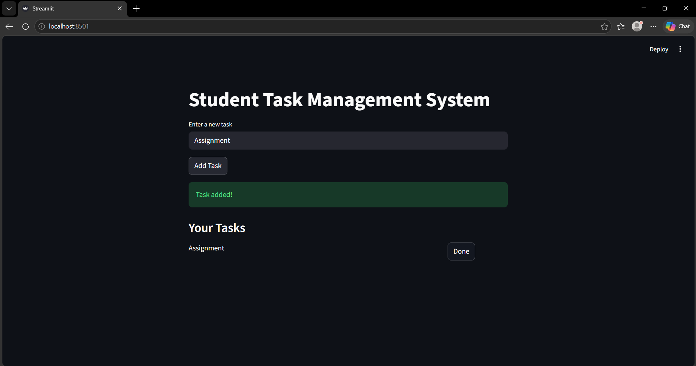
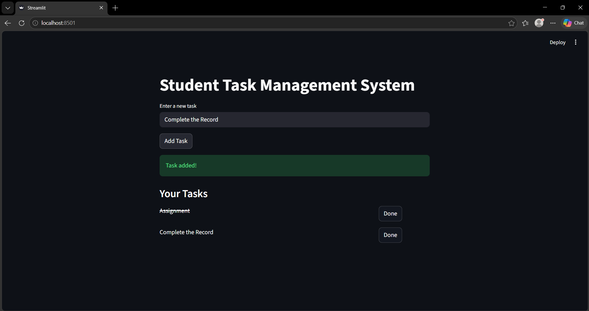

# 📚 Student Task Management System

## 📌 Project Overview

The **Student Task Management System** is a simple web-based application developed using Python and Streamlit. It helps students manage their daily tasks efficiently by allowing them to add, view, and mark tasks as completed.

---

## 🎯 Objectives

* To help students organize their daily activities
* To improve productivity and time management
* To apply project management concepts in a practical project

---

## 🛠️ Technologies Used

* **Python**
* **Streamlit**
* **Git & GitHub**

---

## ⚙️ Features

* ➕ Add new tasks
* 📋 View all tasks
* ✅ Mark tasks as completed

---

## 📊 Project Management Modules Implementation

### 📘  Module 1: Introduction to Project Management

* Defined project goals and objectives
* Identified stakeholders (students, developer, faculty)
* Followed project life cycle phases (Planning → Development → Testing → Deployment)

---

### 📘  Module 2: Risk Management & Planning

#### 🔹 Risk Identification

* Time constraints
* Coding errors
* Technical issues

#### 🔹 Risk Mitigation

* Keep the project simple
* Perform regular testing
* Use simple tools like Streamlit

#### 🔹 Planning

* Duration: 3–4 days
* Resources: Laptop, Python, Internet

---

### 📘  Module 3: Requirements Gathering

#### 🔹 Functional Requirements

* Add tasks
* View tasks
* Mark tasks as completed

#### 🔹 Non-Functional Requirements

* Simple user interface
* Fast performance

---

### 📘  Module 4: Testing & Maintenance

#### 🔹 Testing

Manual testing was performed using test cases:

| Test Case     | Input      | Expected Output       |
| ------------- | ---------- | --------------------- |
| Add Task      | "Study"    | Task added            |
| Complete Task | Click Done | Task marked completed |

#### 🔹 Maintenance

* Fix bugs
* Improve UI if required

---

### 📘 Module 5: Globalization & Internet Impact

* The system can be used globally by students
* The application runs on a web interface
* Internet enables easy deployment and access

---


---

## ▶️ How to Run the Project

1. Install dependencies:

```
pip install -r requirements.txt
```

2. Run the application:

```
python -m streamlit run app.py
```

3. Open in browser:

```
http://localhost:8501
```

---

## 📸 Screenshots

### Home Screen


### Add Task




### Completed Task and added



---

## 🧪 Testing

* Manual testing was performed
* Verified task addition and completion features
* Ensured correct output for all test cases

---

## 📌 Conclusion

This project demonstrates the application of project management concepts in developing a simple and functional software system. It also highlights the importance of planning, risk management, and testing in successful project execution.

---

## 👨‍💻 Author

**Hemanth K S**
